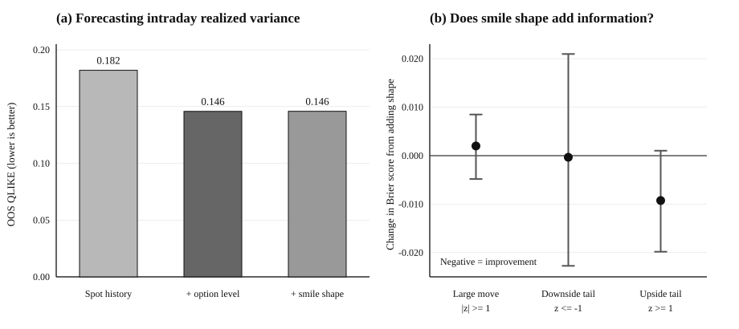

# Do Short-Dated Index Options Contain Anticipative Information?

This repository studies a question motivated by Charles-Albert Lehalle's July 2026 note, [*The Price Discovery Crisis? From Mechanical Flows to Foresight Narratives*](https://www.cmap.polytechnique.fr/~charles-albert.lehalle/blog/2026-07-28/).

Lehalle distinguishes **backward-looking liquidity factors**, which are visible in historical price variation, from **anticipative factors**, which may contain information about future states not yet visible in past returns. Short-dated index options are a natural place to test this distinction: they trade in the same listed market as the underlying, but their prices are explicitly forward-looking and state-contingent.

This study asks two specific empirical questions using NIFTY spot and weekly-option data.

## Research questions

**1. Does the option-implied level contain information about future realized variance beyond the recent spot history?**

At 09:59 IST, we compare a forecast based only on the observed spot/history state with the same forecast augmented by the contemporaneous short-dated option-implied level. The target is NIFTY realized variance from 10:00 to 15:00 on the same trading day.

**2. Conditional on the option-implied movement scale, does smile geometry contain information about which tail is more likely to be realized?**

For the second experiment, future expiry returns are normalized by the ex-ante option-implied scale. We then test whether cross-strike smile information improves forecasts of a large move, a downside tail, or an upside tail after controlling for the option level and recent market state.

## Data and design

The study uses a historical NIFTY spot/options research archive covering **2021-01-01 to 2026-05-14**. Raw market data are not redistributed in this repository.

For Question 1, models are estimated with expanding windows and evaluated over **337 sessions from 2025-01-01 to 2026-05-14**. Forecast quality is measured primarily by QLIKE. Uncertainty is assessed with a paired moving-block bootstrap.

For Question 2, overlapping daily observations are avoided by keeping one observation per weekly expiry. The development sample contains **209 expiries from 2021-2024**; the evaluation sample contains **73 expiries from 2025 to 2026-05-13**. Probability forecasts are evaluated with the Brier score and expiry-level bootstrap intervals.

## Main results

**Option level adds substantial incremental information about near-future variance.** The spot/history-only model has OOS QLIKE **0.18196**. Adding the contemporaneous option-implied level reduces it to **0.14579**, a **19.9% reduction**. The paired bootstrap difference is **-0.0362**, with a 95% interval **[-0.0769, -0.0046]**.

**Adding a simple smile-shape proxy does not improve the same-day variance forecast.** QLIKE changes only from **0.14579 to 0.14587**.

**Smile shape also does not improve prediction of whether the expiry move will simply be large in absolute value.** For a one-implied-scale two-sided breach, the incremental Brier-score change from adding shape is approximately **+0.0020**; positive is worse.

**The only suggestive evidence from smile geometry is directional.** For an upside one-scale breach, adding shape changes the Brier score by approximately **-0.00925**, with a 95% bootstrap interval **[-0.01982, +0.00102]**. This result is not conclusive: there are only **10 upside breaches** in the evaluation sample.

The evidence therefore supports a narrow interpretation: **the option level contains robust incremental information about the magnitude of near-future risk; the evidence that smile geometry contains additional information about the direction of tail risk is weaker and remains hypothesis-generating.** Nothing here establishes that either component is causal or exogenous in Lehalle's stronger sense.

## Figure 1. Incremental information in short-dated NIFTY options



**Panel (a):** OOS QLIKE for the same-day realized-variance forecast. Adding the option-implied level lowers forecast loss materially; adding smile shape does not improve it further. **Panel (b):** change in Brier score when smile shape is added to the tail-probability model, with 95% bootstrap intervals. Negative values indicate improvement.

## Reproduction

The repository contains the analysis code and aggregate results but not the licensed source market data. Expected input schemas are documented in [`data/README.md`](data/README.md).

```bash
python -m pip install -r requirements.txt
python src/run_experiment.py --input data/daily_features.csv
python src/run_phase2.py --input data/expiry_range_close_panel.csv --out results
python src/make_main_figure.py
```

The main scripts are:

- [`src/run_experiment.py`](src/run_experiment.py) — Question 1: incremental realized-variance forecast information.
- [`src/run_phase2.py`](src/run_phase2.py) — Question 2: smile geometry and directional tail probabilities.
- [`src/make_main_figure.py`](src/make_main_figure.py) — reproduces Figure 1 from the versioned aggregate results.

## Author

Aryan Ayyar
