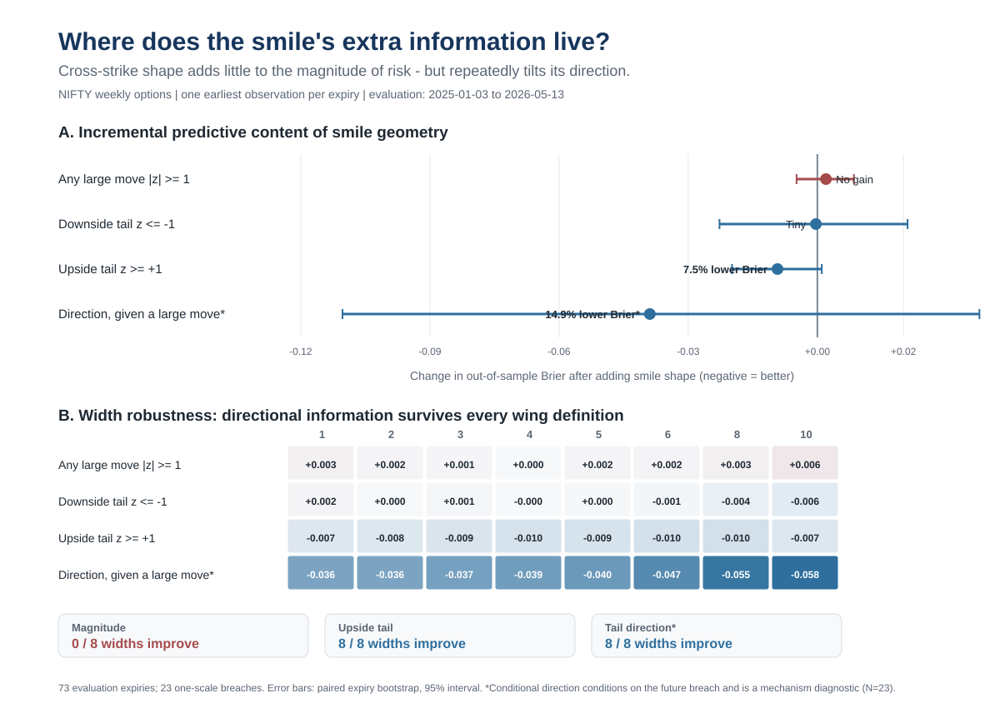

# Options as anticipative factors: where does the smile's information live?

**Exploratory Phase II note - NIFTY weekly options, one non-overlapping observation per expiry**

**Question.** After conditioning on the ATM option-implied movement scale, does cross-strike smile geometry add information about the size of the future move, or about which side of the distribution is tilted?

## Compact out-of-sample readout

| Task | N/events | Brier level | Brier +shape | Delta | AUC level -> shape | Widths improved |
|---|---:|---:|---:|---:|---:|---:|
| Any one-scale breach | 73 / 23 | 0.2268 | 0.2288 | +0.0020 | 0.501 -> 0.493 | 0/8 |
| Downside breach | 73 / 13 | 0.1564 | 0.1561 | -0.0003 | 0.574 -> 0.596 | 4/8 |
| Upside breach | 73 / 10 | 0.1227 | 0.1134 | -0.0092 | 0.605 -> 0.635 | 8/8 |
| Direction given a breach* | 23 / 13 | 0.2632 | 0.2241 | -0.0391 | 0.631 -> 0.685 | 8/8 |

**Readout.** Smile shape does not improve the probability of a two-sided one-scale breach (0/8 wing definitions improve Brier). The strongest OOS signal is directional: upside-breach Brier falls from 0.1227 to 0.1134, and all 8/8 wing definitions improve it. Conditioning on an eventual breach, shape also improves downside-vs-upside classification at all 8/8 widths, but that N=23 diagnostic is not directly tradable and uncertainty remains wide.

**Interpretation.** The evidence is consistent with a decomposition in which ATM level mainly summarizes forward risk magnitude, while cross-strike state prices may encode distributional tilt. This is hypothesis-generating rather than conclusive; the natural next test is the same design using the historical eSSVI state (`theta`, `rho`, `psi`, RR/BF and their changes).

*Direction-given-breach conditions on a future event and is reported only as a mechanism diagnostic. Aggregate outputs and code are reproducible; licensed row-level market data are not redistributed.*
